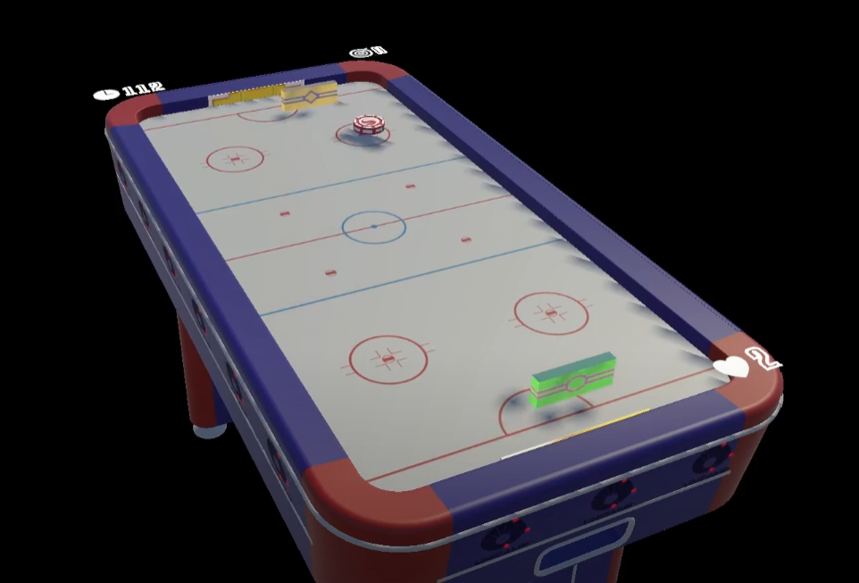
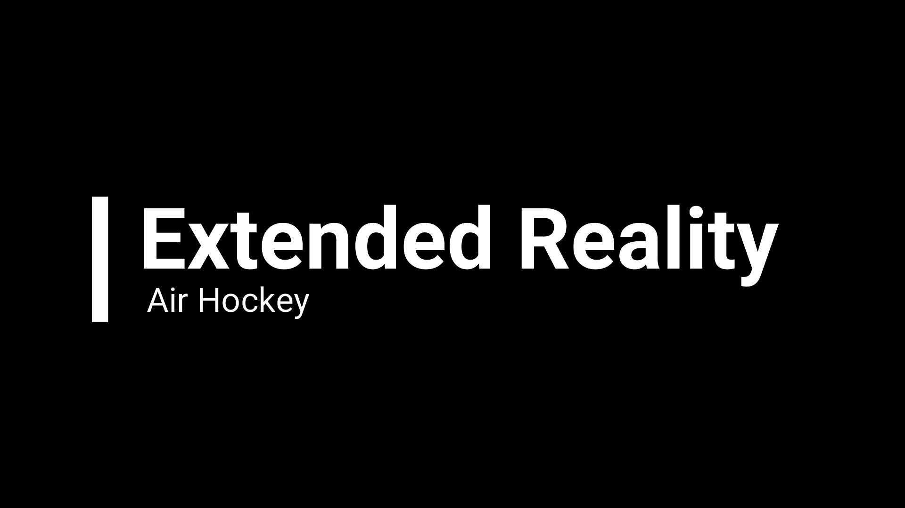

# XR Hockey

An augmented reality air hockey game. Made with Unity and the Snapdragon Spaces SDK for the ThinkReality A3 glasses.

A project made by Unicamp students with support from Qualcomm. This demo was created to be presented at Globecom 2022, which took place in Rio de Janeiro.

[In Game Footage:](https://drive.google.com/file/d/1DEZhFzTdADGc_2Hs7kQLHchSAMSa20mR/view?usp=share_link)

[Behind the scenes:](https://drive.google.com/file/d/1N9ypR-GmAiMs1iWbGPEMYdfs8INhnyta/view?usp=sharing)

## Team

- Unicamp
  - [Ângelo Benetti](https://www.angelobenetti.com.br/) (Modeling)
  - [Elton Cardoso do Nascimento](https://github.com/EltonCN) (Game Design, Programing, VFX)
  - [José Henrique Alves De Oliveira](https://github.com/Dustmaster99) (Game Design, Programing)
  - [José Mario De Martino](https://www.dca.fee.unicamp.br/~martino/) (Coordination, Game Design)
  - [Leonardo Rener de Oliveira](https://github.com/LeonardoRener) (Game Design, Programing, SFX)
- Qualcomm
  - Adrian Nuñez Rocha (Coordination)
  - Andre de Medeiros (Spaces Support)
  - Fernando Rodini (Coordination)

## Made with:
 ![](https://img.shields.io/badge/Snapdragon%20Spaces-FFFFFF?style=for-the-badge&logo=data:image/jpeg;base64,/9j/4AAQSkZJRgABAQEAYABgAAD/2wBDAAMCAgMCAgMDAwMEAwMEBQgFBQQEBQoHBwYIDAoMDAsKCwsNDhIQDQ4RDgsLEBYQERMUFRUVDA8XGBYUGBIUFRT/2wBDAQMEBAUEBQkFBQkUDQsNFBQUFBQUFBQUFBQUFBQUFBQUFBQUFBQUFBQUFBQUFBQUFBQUFBQUFBQUFBQUFBQUFBT/wAARCAAyADIDASIAAhEBAxEB/8QAHwAAAQUBAQEBAQEAAAAAAAAAAAECAwQFBgcICQoL/8QAtRAAAgEDAwIEAwUFBAQAAAF9AQIDAAQRBRIhMUEGE1FhByJxFDKBkaEII0KxwRVS0fAkM2JyggkKFhcYGRolJicoKSo0NTY3ODk6Q0RFRkdISUpTVFVWV1hZWmNkZWZnaGlqc3R1dnd4eXqDhIWGh4iJipKTlJWWl5iZmqKjpKWmp6ipqrKztLW2t7i5usLDxMXGx8jJytLT1NXW19jZ2uHi4+Tl5ufo6erx8vP09fb3+Pn6/8QAHwEAAwEBAQEBAQEBAQAAAAAAAAECAwQFBgcICQoL/8QAtREAAgECBAQDBAcFBAQAAQJ3AAECAxEEBSExBhJBUQdhcRMiMoEIFEKRobHBCSMzUvAVYnLRChYkNOEl8RcYGRomJygpKjU2Nzg5OkNERUZHSElKU1RVVldYWVpjZGVmZ2hpanN0dXZ3eHl6goOEhYaHiImKkpOUlZaXmJmaoqOkpaanqKmqsrO0tba3uLm6wsPExcbHyMnK0tPU1dbX2Nna4uPk5ebn6Onq8vP09fb3+Pn6/9oADAMBAAIRAxEAPwDsP2Kf20NJsbyy+HPxJFksTMINJ166jX5T0WCdiOnZXP0PY1+ia6FpbKCun2ZB5BECf4V/PH4l/wBY/wBa+8v2Iv24/G2k+AF8P+KtIk8U6bZXUdhpeqGcJcKm1iyPkHzFjAX5uDggZPFeBlmJlUpqE9bH61xxklLC4yWKwvuqT1Wyv3X6o/Ss6HpijJ0+0A9fJX/CmJpekSNtSzsnb0WJD/Svzl/bC/aR+IDaLpVlp+qzaNFqvmvJ/ZzmKTy02/Ijde/ODnp2zn5q8L/HL4kaFdWdzonizWJb7esT213ctPEzY4JV8gEjvwchiDmu2rjKdGp7NxPm8v4ZxWYYRYuFWKTvZNvp37bH7Z/2Hp3/AED7X/vyv+FfKX7Zv7Xvhz4C2Enhfw3aafqfjy8hOFVEZNNU8CSUAff7qh9Mnjr4hb/8FEfiHqHwj8QaZpWiWz/EKztzJbzThubcA+ZPGh/1joo3bSe2fmwRX562usX3iHVbnU9Tu5r7ULuVpp7mdizyOxyWYnqSa58Xi0qPNR69T1uHuHZzzL2WYrSD+G+//A/M9FuvGGualdTXdzq97LcXDtLJIZ2yzMck9e5NFY6fdX6UV8FzPuf1pGlTSSUV9xzPib/WSfWvqH9lG3t9V8KaPBGy/aLd5EkhHVdzl9xH+0D19vavl/xN/rH+teh+AdO1i4t9P1LQr+TR7yRh9nnRyisyKBt3Dp26ivq8slOEeaEbn4FxvSw2IrKhiavs7ttO11ddH6n6b69+zvoHxr8GW+k6uptbq2Pm2GoRKDJay4+8B/EOBlT1wPY18Z/G79i/4qfCOzv9RvLqPxP4TA3z6laSOXTByrSRkF159NwBPJr6t/Y9+O2teMrG90DxlaLZeK9H2eeyqEFxExISQAcfw8leDwR1r66hv7W+tGilCSxSKVZHAKsCOQR3Fe9UoU8UufZn5NhM1xuR1Hh01KCd7bp9bp+f3eR+EsOtan4avtM8QaRfZZZvNKxyhgZFILZXsSCOo5DY9a5/x1osHh/4ja1a2kYitGmFxBGvRI5VWRV/AOB+Feq/tHfDq18C/GzxF4d0SLFims3AtIIh90SCIpGB7Fto9hXmXxJ1aHWPidrMtuyvDC8dorr0byY1iyPY7M/jXzdWPLSnF9H/AJn7Xgqka+Ow9eP2ot/L3WvzfzuOT7q/SihPur9KK+ZP29bHM+Jv9ZJ9a+lv2Tf2Yfid8TvhZrmt2enJD4ejlE+kPdOY5rmZSQ5hBGGTjBJIGemSCK7j9j39hi4+NmrQeMfG1tNZ+BreXfBatlH1Rgc4HcRZ6t/FyB3I/VXTNNtNF0+2sLC2is7K2jWGG3gQIkaKMBVA4AAr7jKqE401Ulpc/lrj7NcPXxUsHR95xer7Pt69+2x+Z3wt8X3vgfxlPH4js5tK1qO3WylhuItj4V2bOT1HNfS8PxvstM0aS8lnZ4403bIlLu3soHUmvovXvBug+KNv9saNY6mV4Vrq3WQj6EjIqppvw38K6PIsll4e023dTlWS2TIPqOK9+3Y/JHNyac9bfkfmv4t/Z3+M/jbwz40+Kum6MraxezSXun6TK4+0RQuMNJGMfPIEChVyBxkZOBXwboayJMyyhllDEOHBDBs8596/o+r4P/bg/YNt/GRvPiH8OrCK21+NWm1TR7ddq3+OTLGBwJeuR/F/vdfFxuEbov2fT8T9M4Z4hjHMYrGtRUrJPorbLyXn95+dCfdX6UU9onhYxyI0ciHaysMEEdQRRXwR/Wi2R9rW3jrxJp9jBb2viHVba3iQJHDDeyoiKBgAANgAelQTfEjxaOninWh/3EJv/iqKK+yp7I/l/F/xJ+rKU3xM8XjOPFWtj/uIzf8AxVZ83xP8ZDp4t1wc/wDQSm/+KoorpieDVKsnxS8Z8/8AFXa9/wCDOb/4qqUnxU8a8/8AFYa9/wCDOf8A+KooraJ49Q4W9vLi7vJ5555Jp5ZGeSSRyzOxOSST1JPeiiivEl8TP1Kj/Dj6I//Z) 